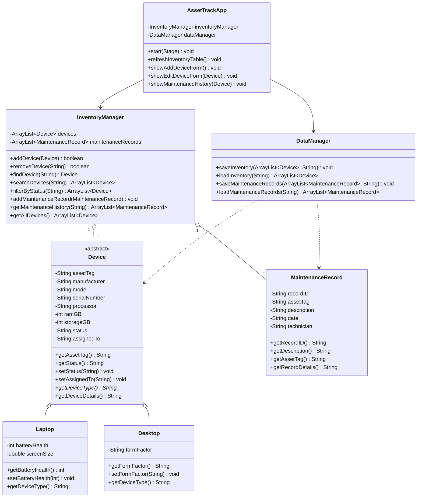

# AssetTrack: Computer Inventory Management System

**Course:** CSI 2300 - Object Oriented Computing  
**Team Name:** AssetTrack Development  
**Team Member:** Scott

## 1. Project Overview

AssetTrack is a Java desktop application designed to help IT departments organize and manage their computer inventory.

The application will allow users to register computers, record hardware specifications, track device assignments, update equipment status, and maintain basic repair records.

This project is inspired by my experience working in IT support, where keeping accurate inventory records is important for managing equipment deployments, repairs, and replacements.

### Planned Features
- Add, edit, and remove computers from inventory.
- Track laptops and desktops separately.
- Record hardware specifications and asset tags.
- Track device status (Available, Deployed, In Repair, Retired).
- Search and filter inventory records.
- Record device maintenance history.
- Save and load inventory data locally.
- Provide a graphical interface using JavaFX.

## 2. Initial UML Class Design

The application will use the following classes:

| Class | Purpose |
|---|---|
| Device (Abstract) | Stores shared computer information and behavior. |
| Laptop | Extends Device with laptop-specific properties. |
| Desktop | Extends Device with desktop-specific properties. |
| MaintenanceRecord | Stores repair and maintenance information. |
| InventoryManager | Manages devices, searching, and maintenance records. |
| DataManager | Handles saving and loading inventory files. |
| AssetTrackApp | Provides the JavaFX graphical interface. |

### UML Class Diagram

The application will demonstrate inheritance, polymorphism, encapsulation, loops, conditions, and Java collections.

## 3. Development Plan

This project will be completed individually. I will be responsible for designing, programming, testing, and documenting the application.

| Phase | Task | Estimated Time |
|---|---|---:|
| 1 | Project proposal and UML design | 4 hours |
| 2 | Implement core device classes | 5 hours |
| 3 | Develop inventory management functionality | 6 hours |
| 4 | Design and implement JavaFX GUI | 10 hours |
| 5 | Implement local data storage | 5 hours |
| 6 | Testing and debugging | 5 hours |
| 7 | Documentation and presentation | 4 hours |
| **Total** | | **39 hours** |

### Project Milestones

- **October 2:** Submit project proposal and initial UML diagram.
- **November 2:** Complete initial GUI design and implement one core class.
- **November 16:** Complete inventory management functionality.
- **November 30:** Complete application development and testing.
- **December 7–9:** Final presentation, demonstration, and GitHub submission.

## Technologies

- Java
- JavaFX
- Object-Oriented Programming
- Local file storage
- GitHub for version control and documentation

*Project developed for CSI 2300*
